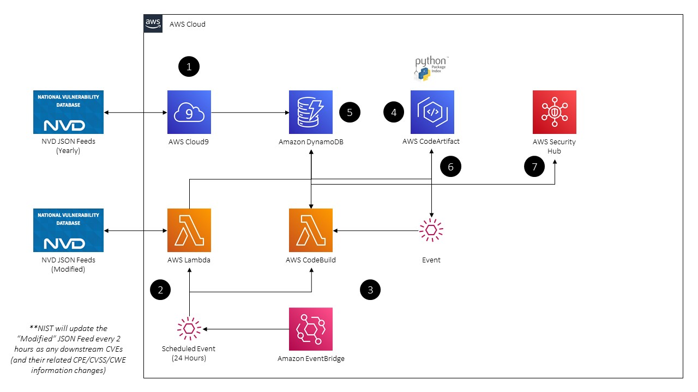
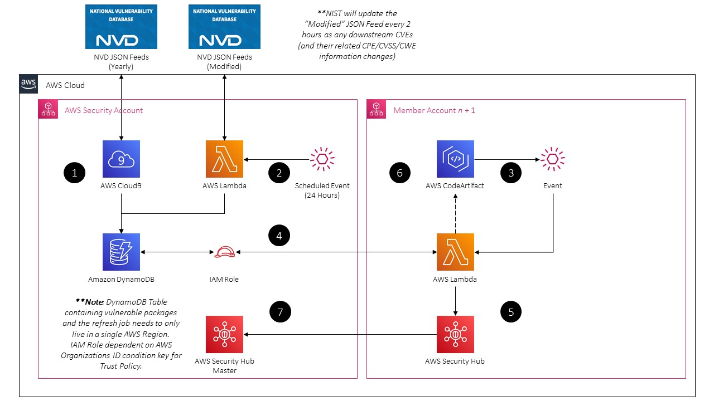

# CodeArtifactVulnScanner

AWS native Static Application Security Testing (SAST) utility to find and eradicate vulnerable packages stored in AWS CodeArtifact. Built for real-time and periodic mulit-Account/multi-Region action.

## Table of Contents

TODO: Implement

## Synopsis

- 100% AWS Serverless implementation of a Static Application Security Testing (SAST) / Software Code Analysis (SCA) purpose built for AWS CodeArtifact. Determine vulnerabilities in code packages by using the [National Institute of Standards and Technology](https://www.nist.gov/) (NIST) [National Vulnerability Database](https://nvd.nist.gov/search) (NVD).

- All software package versions and their associated Common Vulnerabilities and Exposures (CVEs) is parsed from the [NVD JSON Feeds](https://nvd.nist.gov/vuln/data-feeds#JSON_FEED) by parsing the Common Platform Enumeration (CPE) embedded within.

- Configurable Purging of highly vulnerable packages by Common Vulnerability Scoring System (CVSS) v2.0 Base Score or Severity Label. All non-purged, but vulnerable, packages are pushed through as findings into AWS Security Hub as custom findings.

## Solution Architecture

Two different models of deployment are provided at this time. Please see the **Description** or **FAQ** Sections for more information on the models.

### Centralized Deployment (Single-Account / Single-Region)

TODO: Add Steps

### Distributed Deployment (Multi-Account / Multi-Region)

TODO: Add Steps

## Description

This project is an attempt at building a SAST / SCA utility meant for usage with [AWS CodeArtifact](https://docs.aws.amazon.com/codeartifact/latest/ug/welcome.html), a fully managed artifact repository service used with popular build tools and package managers such as NuGet, Maven, Gradle, npm, yarn, pip, and twine. With CodeArtifact, you can centrally store software packages to increase your resilience and software supply chain issues, vulnerabilities, reduce latency or availability concerns due to upstream repository issues, and/or provide a central repository of approved software (by license, etc.).

While there can be many benefits of a centralized (by Organization, Account, or Region) code package repository, one area where AWS is gapping in is a built-in ability to assess vulnerabilities. At the time of this project being started (14 JAN 2021) there were not any commercial offerings known to the author, nor any other open-source tools, and this project attempts to fill that gap. Using native AWS Serverless tools such as DynamoDB, Lambda, and EventBridge, this solution can perform real-time software vulnerability analysis by comparing a package version against a list of vulnerable software provided by the NVD.

To support users of any size, two deployment models will be offered, the *Centralized* model is meant to support CodeArtifact Domains and Repositories within a single Account and Region that may be used to support many different AWS Accounts (or mulit-tenant workloads across various VPCs/Subnets). The *Distributed* model is meant to support any number of AWS Accounts, AWS Regions, and CodeArtifact Domains and Repositories. In the *Distributed* model the vulnerable software packages will be maintained in a central security Account with an Assumable Role that "Trusts" you entire AWS Organization - in the *Centralized* model the vulnerable software packages will be maintained in the same Accounts and Regions you deploy the solution to. DynamoDB is used as the datastore due to the direct AWS Data APIs available, cheap cost, low overhead, and low latency (up to [3000 Read Consumption Units](https://docs.aws.amazon.com/amazondynamodb/latest/developerguide/Limits.html#default-limits-throughput-capacity-modes) (RCUs) before needing to use a [DynamoDB Accelerator](https://docs.aws.amazon.com/amazondynamodb/latest/developerguide/DAX.html) (DAX) cluster).

An optional Purging Engine will be provided for both deployment models that can remove package versions from CodeArtifact based on various inputs such as CVSSv2.0 Base Score or Severity. This can provide assurance than vulnerable software packages will be removed from your central repositories - though this is a Reponse function and not a Preventative control.

In the future, it is planned to add various other features such as Business Intelligence (BI) reporting to monitor vulnerabilities, vendors, licenses, and software version derivations. Other planned features include the ability to scan package dependencies or purge packages based on their license and/or dependencies (**Note:** dependency and license information is populated by CodeArtifact).

## Limitations & Caveats

This section is meant to list out any general warnings or caveats with this solution and is subject to change as the project matures.

- Only CPE "Applications" (software) is parsed - there will not be any vulnerability information on Hardware or Operation Systems (OS).

- Due to the fact that *all* software packages is parsed (by virtue of ingested the entire NVD) - CVSSv2.0 is used for Vector Strings, Scoring, and Severity. Older CVEs, and thus packages, do not have CVSSv3.1 scoring information. This may be added in at a later date - but will require modifications to the Purging Engine.

- Due to using "hacky" methods of parsing Vendors, Package Names, and Package Versions from the CPE URI information within the NVD JSON Feeds - some values that do not format to a nice `package-name.package-version` format (e.g. `python-requests:2.2`) are dropped. For instance, the bulk load and continual loads will drop a value such as `solaris:*`.

- I ***assume*** There may be mismatches between package names in CPE and what they are called by the vendor - and thus you may either get false positives or undetected vulnerabilities! There is way too much data to analyze to determine how extensive this is in reality.

- It goes without saying that if you have any custom software packages you build this will not work. At this time, dependencies (as identified by CodeArtifact) are not evaluated for vulnerabilities.

- If you use CodeArtifact with a [VPC Endpoint](https://docs.aws.amazon.com/codeartifact/latest/ug/vpc-endpoints.html), depending on your [VPC Endpoint Policy](https://docs.aws.amazon.com/codeartifact/latest/ug/create-vpc-endoint-policy.html), you may not be able to reach into certain Repositories to perform purging.

- This solution does not perform license evaluation, nor does the purging engine support it, at least for now.

## Prerequisites

TODO

## Centralized CodeArtifact Setup (Single-Account / Single-Region)

TODO

## Distributed CodeArtifact Setup (Multi-Account / Multi-Region)

TODO

## FAQ

#### 1. What does this solution do?

#### 2. Where is information about software packages and their associated vulnerabilities sourced from?

#### 3. What vulnerability metadata is provided within this solution?

#### 4. How are software vulnerabilities detected?

#### 5. Where is information about detected software vulnerabilities stored?

#### 6. Can I automatically remove vulnerable packages? How does that work?

#### 7. How can I keep track of software packages that were removed via automation?

#### 8. How can I report on software vulnerabilities contained in CodeArtifact?

#### 9. Will this solution work with CodeCommit?

#### 10. Why is CVSSv2.0 used instead of CVSSv3.1?

#### 11. Can I perform vulnerability analysis of package dependencies?

#### 12. Can I report on package licenses? Can I purge based on licenses?

#### 13. Can I used this solution with Artifactory or another package repository?

#### 14. Can I use this solution to find vulnerable packages on my Operating System?

Theoretically, yes. If you had EC2 Instances managed by Systems Manager you could use the Inventory APIs to retrieve software installations and detect if they have any vulnerabilities. You could do similar on container images as well using utilities such as the Python `docker` module. That said, there are built-in vulnerability scanning utilities built into AWS Systems Manager or you can use Amazon Inpsector. Amazon Elastic Container Registry (ECR) also has a built-in vulnerability scanner based on ClairOS, but there are other open-source projects such as Trivy or Anchore that fit the container vulnerability scanning utility.

## Contributing

## License

This library is licensed under the GNU General Public License v3.0 (GPL-3.0) License. See the LICENSE file.