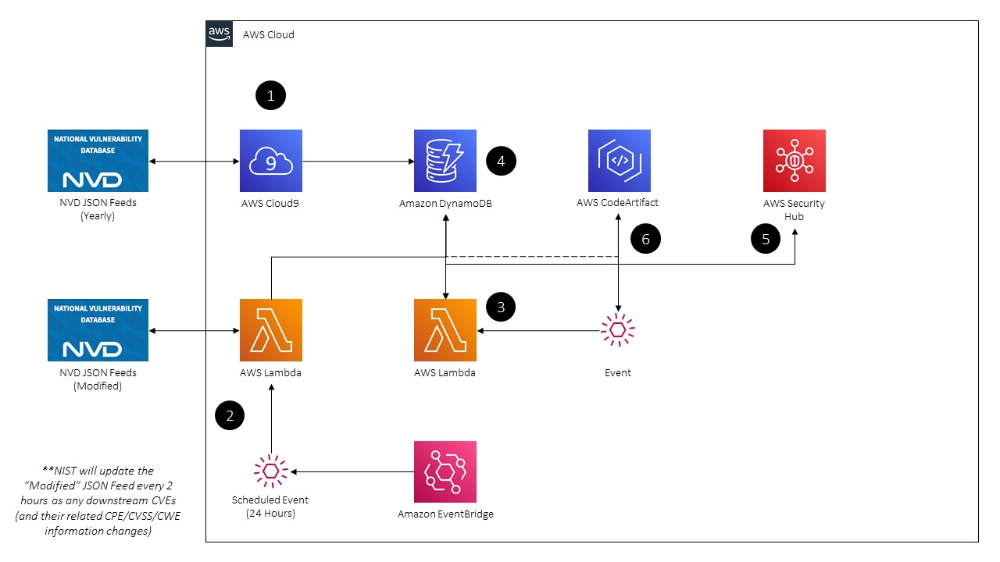

# CodeArtifactVulnScanner (OpenCAVS) [**THIS IS A BETA**]

AWS native Static Application Security Testing (SAST) / Software Composition Analysis (SCA) utility to find and eradicate vulnerable software packages stored in AWS CodeArtifact. Built for both real-time distributed and centralized deployments.

**IMPORTANT NOTE! THIS REPOSITORY REPRESENTS AN UNFINISHED PROJECT THAT IS UNDER ACTIVE DEVELOPMENT AND MAY BE SUBJECT TO RANDOM, RAPID CHANGES - USE AT YOUR OWN RISK!!**

## Table of Contents

- Synopsis
- Solution Architecture
  - Centralized Deployment (Single-Account / Single-Region)
  - Distributed Deployment (Multi-Account / Multi-Region)
- Description
- Limitations & Caveats
- Prerequisites
- Centralized CodeArtifact Setup (Single-Account / Single-Region)
- Distributed CodeArtifact Setup (Multi-Account / Multi-Region)
- FAQ
- Contributing
- License

## Synopsis

- 100% AWS Serverless implementation of a Static Application Security Testing (SAST) / Software Code Analysis (SCA) purpose built for AWS CodeArtifact. Determine vulnerabilities in code packages by using the [National Institute of Standards and Technology](https://www.nist.gov/) (NIST) [National Vulnerability Database](https://nvd.nist.gov/search) (NVD).

- All software package versions and their associated Common Vulnerabilities and Exposures (CVEs) is parsed from the [NVD JSON Feeds](https://nvd.nist.gov/vuln/data-feeds#JSON_FEED) by parsing the Common Platform Enumeration (CPE) embedded within.

- Configurable Purging of highly vulnerable packages by [Common Vulnerability Scoring System](https://nvd.nist.gov/vuln-metrics/cvss) (CVSS) v2.0 and v3.0 Base Scores. All non-purged, but vulnerable, packages are pushed through as findings into AWS Security Hub as custom findings. Purging will be recorded within the Security Hub finding.

## Solution Architecture

Two different models of deployment are provided at this time. Please see the **Description** or **FAQ** Sections for more information on the models.

### Centralized Deployment (Single-Account / Single-Region)



The Centralized setup is also considered an "in-place / local" deployment. This is best suited for smaller AWS Accounts who may be using CodeArtifact in a limited capacity, or for Organizations who want to maintain a single location where CodeArtifact workloads are run. **Note:** If you have different Regions, deploying this solution to them will create their own DynamoDB Tables and manually load the entire NVD into it - you are responsbile for modifying the solution to be able to run Multi-Region.

1. A one-time data load of all yearly NVD JSON Feed files is performed. All files are downloaded, unzipped, parsed, and loaded sequentially and the files destroyed after the setup script runs. **Note:** Ensure you have at least 1GB free on your storage volume to account for the files.

2. Every hour, an Amazon EventBridge [Scheduled Rule](https://docs.aws.amazon.com/eventbridge/latest/userguide/scheduled-events.html) will invoke a Lambda Function that will downloaded the `Modified` NVD JSON Feed, unzip, parse and load items into a DyanmoDB Table. The key schema of the DynamoDB Table will ensure that updates will be overwrite their pre-existing entries, any unique combination of a Package Name, Package Version, and CVE ID will be added as a new item.

3. Upon new software packages being pushed to (or updated within) CodeArtifact, an EventBridge Event will invoke a Lambda Function that will parse information about the software package, the Repository information, and other AWS-specific metadata from the Event payload.

4. The Lambda Function invoked in Step 3 will `Scan()` the DynamoDB Table to retrieve information about the Package and associated vulnerability metadata.

5. If a software vulnerability is found, a finding containing information about the CVE, CVSS metadata, the software, and the owning Repository is created in the Security Hub tenant.

6. **WARNING THIS STEP WILL CHANGE SOON!** If configured, the Purging Engine within the Lambda Function invoked in Step 3 will remove the vulnerable package from CodeArtifact and an Informational finding will be created in Security Hub noting this.

### Distributed Deployment (Multi-Account / Multi-Region)


The following steps describe the event flows for a Distributed setup. The **Security** Account note describes the AWS Account you have the DynamoDB Table and Organization-wide IAM Role deployed to. The **Member** Account note represents many downstream Accounts in many Regions where the CloudWatch Event and Lambda Functions to detect pushes and updates to CodeArtifact are located.

1. (**Security Account**) A one-time data load of all yearly NVD JSON Feed files is performed. All files are downloaded, unzipped, parsed, and loaded sequentially and the files destroyed after the setup script runs. **Note:** Ensure you have at least 1GB free on your storage volume to account for the files.

2. (**Security Account**) Every hour, an Amazon EventBridge [Scheduled Rule](https://docs.aws.amazon.com/eventbridge/latest/userguide/scheduled-events.html) will invoke a Lambda Function that will downloaded the `Modified` NVD JSON Feed, unzip, parse and load items into a DyanmoDB Table. The key schema of the DynamoDB Table will ensure that updates will be overwrite their pre-existing entries, any unique combination of a Package Name, Package Version, and CVE ID will be added as a new item.

3. (**Member Account**) Upon new software packages being pushed to (or updated within) CodeArtifact, an EventBridge Event will invoke a Lambda Function that will parse information about the software package, the Repository information, and other AWS-specific metadata from the Event payload.

4. (**Member Account**) / (**Security Account**) The Lambda Function invoked in Step 3 will attempt to Assume a Role in the Security Account which will give it permissions to `Scan()` the DynamoDB Table to retrieve information about the Package and associated vulnerability metadata.

5. (**Member Account**) If a software vulnerability is found, a finding containing information about the CVE, CVSS metadata, the software, and the owning Repository is created in the Member Account's Security Hub tenant.

6. (**Member Account**) **WARNING THIS STEP WILL CHANGE SOON!**  If configured, the Purging Engine within the Lambda Function invoked in Step 3 will remove the vulnerable package from CodeArtifact and an Informational finding will be created in Security Hub noting this.

7. (**Security Account**) All findings (in their Home Region) are pushed transparently into the Security Hub Master account. You can use this to collect all information about purged packages and vulnerable software in your organization.

## Description

OpenCAVS is an attempt at building a SAST / SCA utility meant for usage with [AWS CodeArtifact](https://docs.aws.amazon.com/codeartifact/latest/ug/welcome.html), a fully managed artifact repository service used with popular build tools and package managers such as NuGet, Maven, Gradle, npm, yarn, pip, and twine. With CodeArtifact, you can centrally store software packages to increase your resilience and software supply chain issues, vulnerabilities, reduce latency or availability concerns due to upstream repository issues, and/or provide a central repository of approved software (by license, etc.).

While there can be many benefits of a centralized (by Organization, Account, or Region) code package repository, one area where AWS is gapping in is a built-in ability to assess vulnerabilities. At the time of OpenCAVS being started (14 JAN 2021) there were not any commercial offerings known to the author, nor any other open-source tools, and OpenCAVS attempts to fill that gap. Using native AWS Serverless tools such as DynamoDB, Lambda, and EventBridge, this solution can perform real-time software vulnerability analysis by comparing a package version against a list of vulnerable software provided by the NVD.

To support users of any size, two deployment models will be offered, the *Centralized* model is meant to support CodeArtifact Domains and Repositories within a single Account and Region that may be used to support many different AWS Accounts (or multi-tenant workloads across various VPCs/Subnets). The *Distributed* model is meant to support any number of AWS Accounts, AWS Regions, and CodeArtifact Domains and Repositories. In the *Distributed* model the vulnerable software packages will be maintained in a central security Account with an Assumable Role that "Trusts" you entire AWS Organization - in the *Centralized* model the vulnerable software packages will be maintained in the same Accounts and Regions you deploy the solution to. DynamoDB is used as the datastore due to the direct AWS Data APIs available, cheap cost, low overhead, and low latency (up to [3000 Read Consumption Units](https://docs.aws.amazon.com/amazondynamodb/latest/developerguide/Limits.html#default-limits-throughput-capacity-modes) (RCUs) before needing to use a [DynamoDB Accelerator](https://docs.aws.amazon.com/amazondynamodb/latest/developerguide/DAX.html) (DAX) cluster).

An optional Purging Engine will be provided for both deployment models that can remove package versions from CodeArtifact based on various inputs such as CVSSv2.0 Base Score or Severity. This can provide assurance than vulnerable software packages will be removed from your central repositories - though this is a Response function and not a Preventative control.

In the future, it is planned to add various other features such as Business Intelligence (BI) reporting to monitor vulnerabilities, vendors, licenses, and software version derivations. Other planned features include the ability to scan package dependencies or purge packages based on their license and/or dependencies (**Note:** dependency and license information is populated by CodeArtifact).

## Limitations & Caveats

This section is meant to list out any general warnings or caveats with this solution and is subject to change as the project matures.

- Only CPE "Applications" (software) are parsed - there will not be any vulnerability information on Hardware or Operation Systems (OS).

- I ***assume*** There may be mismatches between package names in CPE and what they are called by the vendor - and thus you may either get false positives or undetected vulnerabilities! There is way too much data to analyze to determine how extensive this is in reality.

- It goes without saying that if you have any custom software packages you build this will not work. At this time, dependencies (as identified by CodeArtifact) are not evaluated for vulnerabilities.

- If you use CodeArtifact with a [VPC Endpoint](https://docs.aws.amazon.com/codeartifact/latest/ug/vpc-endpoints.html), depending on your [VPC Endpoint Policy](https://docs.aws.amazon.com/codeartifact/latest/ug/create-vpc-endoint-policy.html), you may not be able to reach into certain Repositories to perform purging.

- This solution does not perform license evaluation, nor does the purging engine support it, at least for now.

## Prerequisites

- A Cloud9 IDE running Ubuntu 18.04LTS with the below IAM Policy attached as an Instance Profile for the underlying EC2 Instance. For more information on setting up a Cloud9 IDE see [here](https://docs.aws.amazon.com/cloud9/latest/user-guide/setting-up.html), and for information on attaching an IAM Instance Profile see [here](https://docs.aws.amazon.com/AWSEC2/latest/UserGuide/iam-roles-for-amazon-ec2.html).

```json
{
    "Version": "2012-10-17",
    "Statement": [
        {
            "Sid": "VisualEditor0",
            "Effect": "Allow",
            "Action": [
                "dynamodb:CreateTable",
                "s3:PutObject",
                "s3:GetObjectAcl",
                "s3:GetObject",
                "s3:ListAllMyBuckets",
                "dynamodb:PutItem",
                "cloudformation:*",
                "s3:ListBucket",
                "s3:PutObjectAcl"
            ],
            "Resource": "*"
        }
    ]
}
```

**Note:** You should perform additional scoping by adding condition keys, specifying resources, and finding out what CloudFormation Permissions you *actually* need - I got lazy - sorry.

- AWS Security Hub enabled.

- At least one CodeArtifact Domain and Repository created, obviously.

- An S3 Bucket that you can upload ZIP files to (this is taken care of by the setup scripts, you just need a bucket you have IAM permissiosn to `PutObject` for).

For the Distributed Deployment Model, you will need the following in addition to the above.

- An IAM Role setup for CloudFormation Stack Sets deployments with [Trusted Access for AWS Organizations](https://docs.aws.amazon.com/AWSCloudFormation/latest/UserGuide/stacksets-orgs-enable-trusted-access.html).

- A list of AWS Account IDs or Organizational Unit (OU) IDs to deploy the Stack Set into.

- Your AWS Organization ID used for the Trust Policy Condition.

## Centralized CodeArtifact Setup (Single-Account / Single-Region)

TODO

## Distributed CodeArtifact Setup (Multi-Account / Multi-Region)

TODO

## FAQ

#### What does this solution do?

OpenCAVS provides a mechanism with which to locate known vulnerable software packages and their associated vulnerabilities (and vulnerability metadata) from the NIST NVD and store them within DynamoDB. EventBridge and Lambda are utilized to perform event-driven vulnerability analysis of software packages being pushed into or updated within an AWS CodeArtifact Repository. 

Optionally, you can configure this solution to purge vulnerable packages in CodeArtifact based on a specific CVSS score or stated severity level. This solution can be deployed for a centralized CodeArtifact model or to support a distributed model across many Accounts, Regions, and CodeArtifact Repositories.

#### What is Software Composition Analysis (SCA)?

SCA is a type of application security testing tool / technique to located vulnerabiliites within a software package as well as provide a software asset inventory, dependency tracking, license compliance and expose those data points to end users. In that light, SCA is more than just a security tool, many personas in an organization can make use of the tool to answer questions such as "What software do we use?", "Do we have any Apache 2.0 or GPLv3 licenses in use?", "How reliant is our code base on open source software (OSS)"?, or "What security or privacy issues are introduced from our codebase?".

Something more formal, as per [Whitesource Software](https://resources.whitesourcesoftware.com/blog-whitesource/software-composition-analysis): "Software Composition Analysis (SCA) is a segment of the application security testing (AST) tool market that deals with managing open source component use. SCA tools perform automated scans of an application’s code base, including related artifacts such as containers and registries, to identify all open source components, their license compliance data, and any security vulnerabilities. In addition to providing visibility into open source use, some SCA tools also help fix open source vulnerabilities through prioritization and auto remediation."

#### What is Static Application Security Testing (SAST)?

SAST is a type of application security testing tool that analyzes source code and dependencies (binaries, libraries, etc.) for known security vulnerabilities. It does not examine a compiled / running application or package and is a "first line of defense" sort of tool that has some overlap with a SCA Tool.

Something more formal, as per [Gartner](https://www.gartner.com/en/information-technology/glossary/static-application-security-testing-sast): "Static application security testing (SAST) is a set of technologies designed to analyze application source code, byte code and binaries for coding and design conditions that are indicative of security vulnerabilities. SAST solutions analyze an application from the “inside out” in a nonrunning state."

#### What commercial tool(s) are similar to OpenCAVS?

Any SAST or SCA tool within the application security (AppSec) segment is comprable to the features of this tool, though commercial offerings are typically more robust and often enhance or enrich their solutions with their own internal security research, threat intelligence, and/or software inventories. Tools such as these include offerings from [Snyk.io](https://snyk.io/), [WhiteSource Software](https://www.whitesourcesoftware.com/), [Checkmarx](https://www.checkmarx.com/), or [Micro Focus Fortify](https://www.microfocus.com/en-us/products/static-code-analysis-sast/overview).

It is important to note that those offerings (and others in the segment) are often very robust and made to run on top of a variety of artifact repositories or within CI/CD pipelines, they can perform scans based on dependencies located in your OS that correspond to a specific language such as NodeJS's `package_lock.json` or Python `wheels`. OpenCAVS is entirely dependent on CodeArtifact's schema of software inventory as well as running in an "out-of-pipeline" mode in reaction to packages being pushed to CodeArtifact.

The author reccomends that you use additional open source tools such as Bandit for Python or GoSec for Go, and other application security testing tools such as secrets scanning, dependency management, and Dynamic Application Security Testing (DAST) products -- a "defense in depth" strategy is needed for a succesful AppSec program but above all well-trained and security-aware developers with a culture that promotes innovation and doesn't use software vulnerabilities as a hammer is the best fit.

#### Where is information about software packages and their associated vulnerabilities sourced from?

All vulnerability, software package, and associated metadata (references, CVSS scoring information, etc.) is parsed from NIST's NVD JSON Feeds. A one-time load of all Yearly feeds is performed, and a Lambda Function invoked on a schedule will perform additions or updates to files based on a specialized `Modified` feed from the NVD JSON Feeds.

#### What is the process flow for evaluating vulnerabilities? How does the solution account for Software Package Versions that have Patch or Beta versions noted (e.g., 1.22.1.4?)?

Simply, if there any software package versions that cannot be converted to a `float` are forced converted into one by creating a new `float` from the Major and Minor Version (thus dropping any Patch, Beta, or other version number). This is noted several time in the codebase as a workaround which may produce an unknown amount of false positives or false negatives. At this time, that functionality will not be modified.

TODO: Add process flow

#### What vulnerability metadata is provided within this solution?

The ID of the CVE, the first reference link, a CVE description, the CVSSv2.0 & CVSSv3.0 Vector String, CVSSv2.0 & CVSSv3.0 Base Score, CVSSv2.0 & CVSSv3.0 Severity Label, and the Package Name, Package Version are parsed from the NVD JSON Feeds.

#### How are software vulnerabilities detected?

Upon invocation from Amazon EventBridge, a Lambda Function will perform a `Scan()` API call against the DynamoDB table that contains information on all vulnerable software. If there is a match, the CVE ID and related CVSSv2.0 metadata is returned to Lambda. If there is not a match no further actions will be taken.

#### Where is information about detected software vulnerabilities stored?

Upon detection of a vulnerable software package, a finding will be created in AWS Security Hub that will contain information about the vulnerable software package, which CodeArtifact Repository it was contained in, and other helpful information such as the Account, Region, time seen, resource ARNs and related vulnerability metadata.

#### Can I automatically remove vulnerable packages? How does that work?

Yes. Upon vulnerable software being discovered, findings will be created in AWS Security Hub, and these findings will in turn trigger another downstream Lambda Function via the EventBridge integration that Security Hub has. Depending on a threshold for both CVSSv2.0 and CVSSv3.0, the finding will be purged, it is important to set thresholds on both CVSS scoring versions as not every CVE will have both available. The removal (aka Purge) will happen by using the CodeArtifact [`DisposePackageVersions`](https://boto3.amazonaws.com/v1/documentation/api/latest/reference/services/codeartifact.html#CodeArtifact.Client.dispose_package_versions) API.

#### What is the process flow for the Purging Engine?

A Lambda Function will be triggered upon vulnerable software package findings being created in Security Hub. During setup, you will have provided values to set as thresholds for both CVSSv2.0 and CVSSv3.0, which will be evaluated in that order. If the CVSS Base Score is greater than or equal to the threshold you set, the software package version will be removed from CodeArtifact and the finding in Security Hub will be updated.

TODO: Add process flow.

#### How can I keep track of software packages that were removed via automation?

If a vulnerable software package finding is pushed into AWS Security Hub, the finding will be updated by the downstream Purging mechanism to note that it was removed and the timestamp of the removal will be recorded in the Security Hub finding's schema using the `UpdatedAt` timestamp value.

#### How can I report on software vulnerabilities contained in CodeArtifact?

You can use Security Hub Insights or perform ingestion into another BI tool from Security Hub. In the future, an integration with Amazon QuickSight may be developed - in the meantime you can use this example from ElectricEye-Reports, an open-source AWS-native cloud security posture management (CSPM) tool by OpenCAVS's author.

#### Will this solution work with CodeCommit?

No, not as designed. Any modifications to this solution for purpose of scanning dependencies within CodeCommit are out of scope but could perhaps be added in scope in the future. I do reccomend using [Amazon CodeGuru Reviewer](https://aws.amazon.com/codeguru/) (if you use Python or Java) though, it has some built in [Security](https://aws.amazon.com/about-aws/whats-new/2020/12/amazon-codeguru-reviewer-announces-security-detectors-improve-code-security/) checks.

#### Why is both CVSSv2.0 and CVSSv3.0 recorded?

Due to the age of CVEs, some existed before CVSSv3.0 was released. NIST does not appear to perform retrospective updates of the CVSS Scoring and so both versions of CVSS are collected.

#### I have a vulnerable software package that was not purged! Why?

Some CVEs do not have any CVSS scoring information recorded at all, and thus, purging will not work - these types of CVEs are hardcoded with a `0` CVSS Base Score to avoid schema issues within DynamoDB.

#### Can I perform vulnerability analysis of package dependencies?

This feature is out of scope for this solution for the time being. In the future another extension will be included within Lambda to detect vulnerabilities (and purge the package) based on dependencies.

#### Can I report on package licenses? Can I purge based on licenses?

Not at this time to either part of the question. In the future, this feature will be added.

#### Can I use this solution with Artifactory or another package repository?

Not as configured, you should probably use [JFrog XRAY](https://jfrog.com/xray/) though, if you're already setting your money on fire to use Artifactory you obviously don't care about it to begin with.

#### How is vulnerability information maintained?

Every hour an Amazon EventBridge Scheduled Rule will invoke a Lambda Function that will download the `Modified` NVD JSON Feed and add the information into DynamoDB. Existing items will be overwritten based on their Software Package and CVE ID pair; new items will just be inserted like a regular item into the table. NIST maintains a 2-hour SLA to push any updates into the `Modified` feed based on if there are actually any changes. These changes may not include ones that are relevant to this solution (such as Common Weaknesses and Exploits (CWE) or reference metadata).

Running that Lambda function every hour ensures you will not likely miss an updated, as during that 2-hour window if there are any changes the older updated entries will be removed from the file.

#### How can I ensure I stay in sync with upstream NVD Changes in case of Lambda failures due to transient errors or Region outages?

The only way to ensure you will stay 100% up-to-date in the event that AWS Lambda goes down, or some other failure prevents you from downloading and parsing the payloads, is to run the manual load from another location.

#### I want to export the package vulnerability information; how can I do that?

A Python script is provided in the `/exports` directory which will read out the entire contents of the DyanmoDB table and write them into JSON, CSV or both. The script accepts a positional argument of either `JSON`, `CSV`, or `BOTH` via `sys.argv` (e.g., `python3 packageExport.py CSV`) and will create the correspond file(s).

#### How much does this solution cost to run?

**TL;DR** This solution will cost less than $10/Month to run under normal circumstances (500K evaluations/Mth, 100K Security Hub Findings)

An exact estimation will be hard to produce without historical numbers, to perform your own cost analysis you will need to factor in how many Accounts and across how many Regions this solution will be deployed. To perform you own estimate you will need to use the [AWS Pricing Calculator](https://calculator.aws/#/createCalculator) and the following pricing pages per service used:

  - [Lambda Pricing](https://aws.amazon.com/lambda/pricing/)
  - [DynamoDB Pricing](https://aws.amazon.com/dynamodb/pricing/)
  - [EventBridge Pricing](https://aws.amazon.com/eventbridge/pricing/)
  - [Security Hub Pricing](https://aws.amazon.com/security-hub/pricing/)

The most common scenario based on my testing is the initial setup will be the most expensive - assuming 800K entries for loading all of the vulnerable software packages (as of 17 JAN 2021) with an average size of 1.25KB that comes out to 1GB/Mth of Storage ($0.25) and ~$2.00 for ~1.6M WCUs for a total of $2.25.

On average there are ~750 entries within the `Modified` NVD feed, if you performed a load every hour as configured, that is an additional $1.35/Month (~1M WCUs). If you performed 500K/Month strongly consistent lookups against DynamoDB (OpenCAVS used `Scan()` by default) that will be $0.13/Month. Assuming 720 Lambda requests lasting ~30 seconds each to perform this load, that falls well under the free tier. If you did an additional 2M invocations (well above what we estimated for DynamoDB Reads) that would cost $0.20/Month.

The last piece is EventBridge ($1/Million Events - you will likely stay far below that) and Security Hub. Assuming 500K evaluations, and 20% are vulnerable packages, that is 100K Security Hub Findings/Month which are billed at $0.00003 per Finding - that comes out to $3. Assuming you hit 1M Events - **the above estimate would cost $7.93/Month** - as the DynamoDB Table will still be in a Single Region and a Single Account for the Distributed or Centralized Deployments.

## Contributing

TODO

## License

This library is licensed under the GNU General Public License v3.0 (GPL-3.0) License. See the LICENSE file.